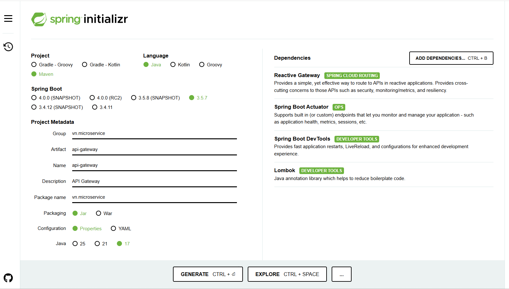
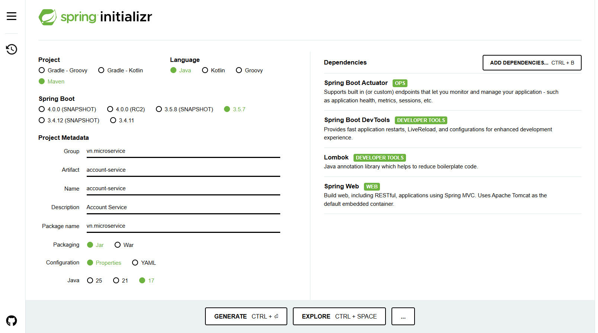
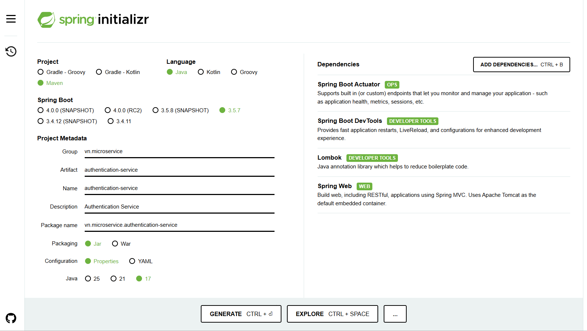

## 1. API gateway (Spring Cloud gateway)
- Tạo ___API Gateway___ tại [Spring Initializr](https://start.spring.io/)



- Cấu hình `API gateway`
```yaml
spring:
  config:
    activate:
      on-profile: dev
  devtools:
    add-properties: true
  cloud:
    gateway:
      server:
        webflux:
          globalcors:
            corsConfigurations:
              '[/**]':
                allowedOrigins: "http://localhost:5173"
                allowedHeaders: "*"
                allowedMethods:
                  - GET
                  - POST
                  - PUT
                  - PATCH
                  - DELETE
                  - OPTIONS
          routes:
            - id: authentication-service
              uri: http://${HOST_NAME:localhost}:8081/auth
              predicates:
                - Path=/auth/**, /v3/api-docs/authentication-service
              filters:
                - RewritePath=/auth/(?<segment>.*), /$\{segment}
                - CustomizeFilter
            - id: account-service
              uri: http://${HOST_NAME:localhost}:8082
              predicates:
                - Path=/account/**, /v3/api-docs/account-service
              filters:
                - RewritePath=/account/(?<segment>.*), /$\{segment}
                - CustomizeFilter
```

- Kiểm tra sức khỏe của `API Gateway` bằng command line
```
$ curl --location 'http://localhost:4953/actuator/health'
{
    "status": "UP"
}
```

## 2. Account Service
- Tạo ___API Gateway___ tại [Spring Initializr](https://start.spring.io/)

- 

## 3. Authentication Service
- Tạo ___API Gateway___ tại [Spring Initializr](https://start.spring.io/)

- 

## [Swagger](http://localhost:8081/swagger-ui/index.html)